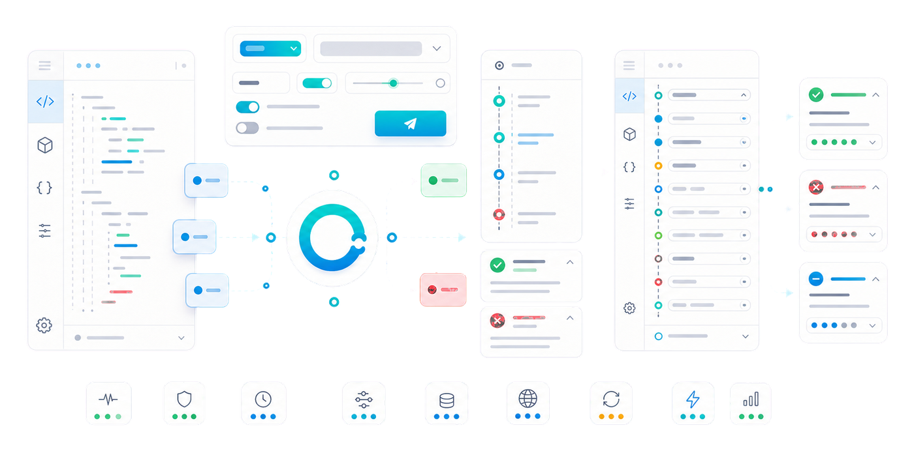
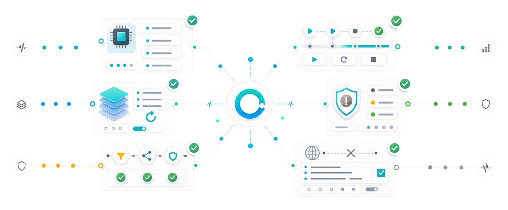
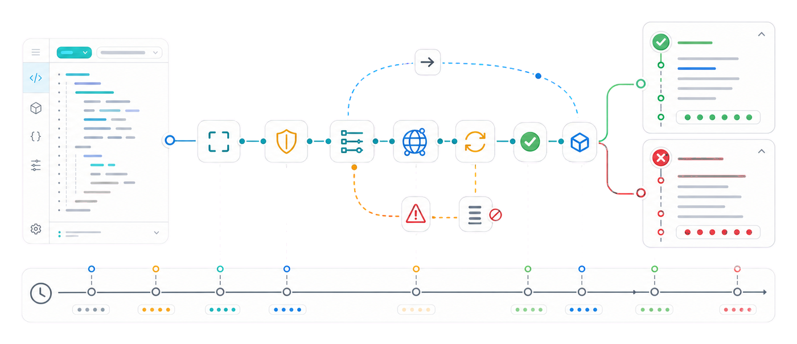
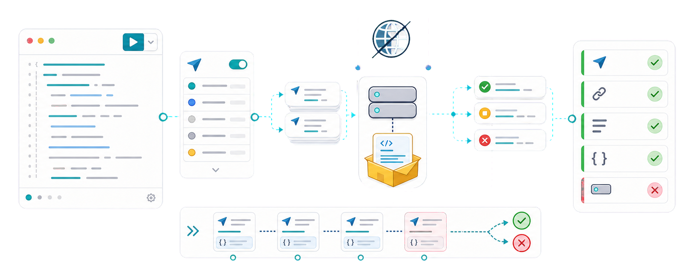

<p align="center">
  <picture>
    <source media="(prefers-color-scheme: dark)" srcset="assets/readme/hero-dark.png">
    <source media="(prefers-color-scheme: light)" srcset="assets/readme/hero-light.png">
    
  </picture>
</p>

<h1 align="center">Oxy</h1>

<p align="center">
  <strong>Policy-first HTTP for Dart and Flutter.</strong>
  <br>
  Build reusable API clients with explicit policies, typed request failures,
  replayable bodies, lifecycle middleware, and deterministic tests.
</p>

<p align="center">
  <a href="https://github.com/medz/oxy/actions/workflows/ci.yml"></a>
  <a href="https://pub.dev/packages/oxy"></a>
  <a href="https://github.com/medz/oxy/blob/main/LICENSE"></a>
</p>

<p align="center">
  <a href="#quick-start">Quick start</a>
  ·
  <a href="#build-api-clients">API clients</a>
  ·
  <a href="#request-lifecycle">Lifecycle</a>
  ·
  <a href="#test-without-a-server">Testing</a>
  ·
  <a href="doc/cookbook.md">Cookbook</a>
  ·
  <a href="https://pub.dev/documentation/oxy/latest/">API docs</a>
</p>

Oxy gives Dart and Flutter network code a small owned model around `Client`,
`Request`, `Response`, `Headers`, `Body`, `Policy`, `Middleware`,
`RequestError`, and `Result`. It is designed for codebases where HTTP calls
should become a reliable internal API client instead of a spread of one-off
request snippets.

## Why Choose Oxy

<p align="center">
  <picture>
    <source media="(prefers-color-scheme: dark)" srcset="assets/readme/confidence-dark.png">
    <source media="(prefers-color-scheme: light)" srcset="assets/readme/confidence-light.png">
    
  </picture>
</p>

Choose Oxy when you want:

- A reusable `Client` with a base URL, default headers, keep-alive transport,
  middleware, hooks, and per-request overrides.
- Policies for timeout, retry, redirect, and status validation that are visible
  at the client boundary instead of scattered through call sites.
- Typed failures through `RequestError` subtypes, including `StatusError`,
  timeout, network, decode, body, retry, cancel, and middleware failures.
- Safe retry behavior: replayable request bodies can be retried, one-shot
  streams are never retried implicitly.
- Middleware with lifecycle capabilities for request transforms, cache
  resolution, per-attempt handling, and final response processing.
- `MockTransport` tests that exercise the real Oxy pipeline without opening a
  socket or running a server.

Another package may be a better fit when `package:http` is enough, when `dio`
already matches your Flutter app conventions, or when you want generated
interfaces from `chopper` or `retrofit`.

## Quick Start

```sh
dart pub add oxy
```

Use `fetch(...)` for one-off requests:

```dart
import 'package:oxy/oxy.dart';

Future<void> main() async {
  try {
    final response = await fetch('https://httpbin.org/get');
    final payload = await response.json<Map<String, Object?>>();

    print(payload['url']);
  } finally {
    await client.close();
  }
}
```

Create a long-lived `Client` when requests should share defaults, policies,
middleware, or native keep-alive connections:

```dart
import 'package:oxy/oxy.dart';

Future<void> main() async {
  final client = Client(
    ClientOptions(
      baseUrl: Uri.parse('https://httpbin.org'),
      timeoutPolicy: const TimeoutPolicy(total: Duration(seconds: 10)),
      retryPolicy: const RetryPolicy(maxRetries: 2),
    ),
  );

  try {
    final response = await client.post('/post', json: {'name': 'oxy'});
    final payload = await response.json<Map<String, Object?>>();
    print(payload['json']);
  } finally {
    await client.close();
  }
}
```

## Build API Clients

Oxy is meant to sit behind small package or app-specific clients. Put the HTTP
rules in one `Client`, then expose domain methods from your own API wrapper:

```dart
class UsersApi {
  UsersApi(this._client);

  final Client _client;

  Future<Map<String, Object?>> getUser(String id) async {
    final response = await _client.get('/users/$id');
    return response.json<Map<String, Object?>>();
  }
}

final client = Client(
  ClientOptions(
    baseUrl: Uri.parse('https://api.example.com'),
    timeoutPolicy: const TimeoutPolicy(total: Duration(seconds: 10)),
    retryPolicy: const RetryPolicy(maxRetries: 2),
  ),
);

final users = UsersApi(client);
```

That shape keeps parsing, base URLs, authorization, timeout behavior, retry
rules, and status handling out of UI and feature code.

## Request Lifecycle

<p align="center">
  <picture>
    <source media="(prefers-color-scheme: dark)" srcset="assets/readme/trace-dark.png">
    <source media="(prefers-color-scheme: light)" srcset="assets/readme/trace-light.png">
    
  </picture>
</p>

One user call moves through a precise pipeline: request preparation, application
middleware, one or more guarded transport attempts, redirect and retry
decisions, status validation, lifecycle hooks, and a single typed return path.

```dart
final client = Client(
  ClientOptions(
    timeoutPolicy: const TimeoutPolicy(total: Duration(seconds: 20)),
    retryPolicy: const RetryPolicy(maxRetries: 1),
    redirectPolicy: RedirectPolicy.manual,
    statusPolicy: StatusPolicy.throwOnError,
  ),
);
```

Use per-request options when one call needs different behavior:

```dart
final response = await client.get(
  '/missing',
  options: const RequestOptions(statusPolicy: StatusPolicy.returnResponse),
);
```

Middleware is configured as one list. Each middleware declares the lifecycle
capabilities it needs, and Oxy schedules those capabilities at the right phase:

```dart
final client = Client(
  ClientOptions(
    middleware: [
      RequestIdMiddleware(),
      AuthMiddleware.staticToken('secret'),
      CookieMiddleware(),
      CacheMiddleware(),
      LoggingMiddleware(),
    ],
  ),
);
```

## Typed Errors and Result

By default Oxy throws `RequestError` subtypes for failures. Non-2xx responses
fail with `StatusError` unless status validation is disabled for that request.

Use `Result` when a caller should branch without `try`/`catch`:

```dart
final result = await client.requestResult('GET', '/health');

final message = result.fold(
  onSuccess: (response) => 'status ${response.status}',
  onFailure: (error, trace) => 'failed with $error',
);
```

`Result.getOrThrow()` restores the exception path later while preserving the
captured stack trace.

## Test Without a Server

<p align="center">
  <picture>
    <source media="(prefers-color-scheme: dark)" srcset="assets/readme/testing-dark.png">
    <source media="(prefers-color-scheme: light)" srcset="assets/readme/testing-light.png">
    
  </picture>
</p>

`MockTransport` lets tests exercise the real `Client` pipeline without opening
a socket:

```dart
import 'package:oxy/oxy.dart';
import 'package:oxy/testing.dart';

final transport = MockTransport((request, context) async {
  if (request.headers.get('authorization') != 'Bearer secret') {
    throw StateError('missing authorization');
  }
  return Response.json({'ok': true});
});

final client = Client(ClientOptions(transport: transport));
```

`transport.requests` records prepared requests, which is useful for checking
methods, URLs, headers, and body behavior after the call.

## Bodies and Replayability

Oxy owns its public `Client`, `Request`, and `Response` model, and selectively
exports mature body helpers from `ht` for form construction. `ht.Request` and
`ht.Response` are not part of Oxy's public API.

```dart
final form = FormData()
  ..append('name', const Multipart.text('oxy'))
  ..append('file', Multipart.blob(Blob(['hello'], 'text/plain'), 'hello.txt'));

await client.post('/upload', body: form);
```

`String`, `List<int>`, `Uint8List`, JSON bodies, `Blob`, `FormData`, and
`URLSearchParams` are replayable. Raw `Stream<List<int>>` bodies are one-shot,
so Oxy will not retry them implicitly. Use `Response.buffered()` when later code
needs to read a streaming response more than once.

## More Examples

The [cookbook](doc/cookbook.md) covers reusable API clients, policies,
no-throw `Result` flows, middleware composition, deterministic testing, and body
replayability. The Dart files under [example/](example/) are checked by
`dart analyze`.

Oxy is pre-1.0, so minor releases may include breaking changes while the package
hardens. Breaking changes before 1.0 should be deliberate, documented in
[CHANGELOG.md](CHANGELOG.md), and focused on making the `Client`, `Request`,
`Response`, policy, middleware, typed error, `Result`, and single-package
native/Web model simpler or safer.

## License

MIT
